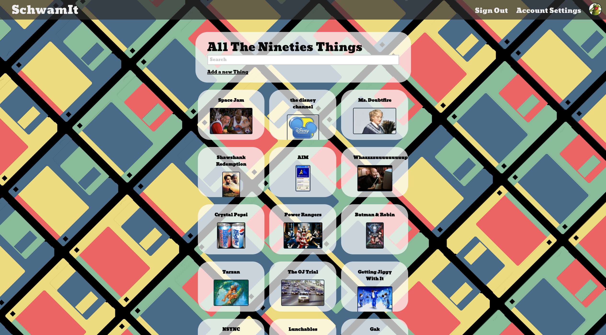
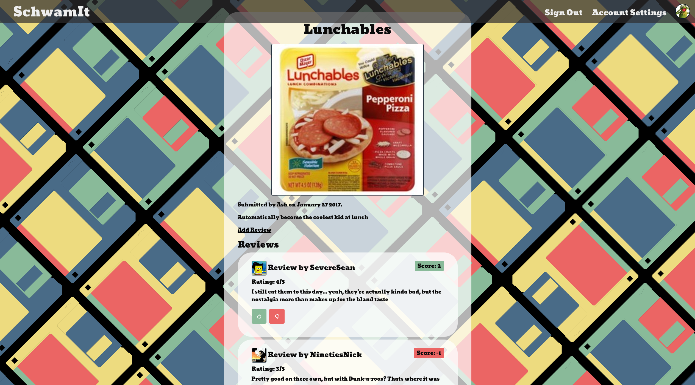

# SchwamIt

## Overview

[SchwamIt](schwamit.herokuapp.com) is a review site dedicated to topics from the 1990's.

Authors:

* [Yonatan Meschede-Krasa](https://github.com/yonatanmk)
* [Nick Asilo](https://github.com/nasilo)
* [Nick Belanger](https://github.com/nh-belanger)
* [Scott Ehrmann](https://github.com/sehrmann)
* [Sean Kalil](https://github.com/kseans8)

Reviewers:

* [Nick Alberts](https://github.com/nwalberts)
* [Lily Barrett](https://github.com/lilybarrett)
* [Amanda Beiner](https://github.com/amandabeiner)
* [Jenn Eng](https://github.com/jennceng)
* [Justin Huynh](https://github.com/justinhuynh)
* [Eben Lowe](https://github.com/enthusiastick)
* [Mike Thomson](https://github.com/michaelgt04)

##Features

* This is a site based on user-generated content. All content is publicly available; visitors can see all content, but not submit items, reviews, or vote on reviews. Once a visitor has created an account, they are free to perform these actions.

* The index and search pages automatically update to show newly posted content in real time.

* Users can submit items, along with images that are stored using Amazon S3 Cloud Storage Service.

* Users can post reviews which are organized by their scores with the highest scoring reviews appearing at the top of the list.

* Voting on reviews updates the reviews' score in real time.

* Admins can delete unwanted content as well as delete toxic user accounts.

* Users are notified via email when their items have received a new review.

##Core Technologies

###Stack

* PostgreSQL
* ActiveRecord
* Ruby on Rails
* React
* Foundation

###Test

* RSpec
* Capybara
* Enzyme
* Karma
* PhantomJS
* Jasmine
* Coveralls
* Codeship
* CodeClimate
* FactoryGirl
* DatabaseCleaner

###Gems
* SimpleForm
* Devise
* CarrierWave
* Google reCAPTCHA
* FontAwesome
* ActionMailer
